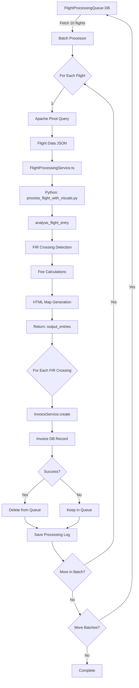

# Flight Batch Processing System - Walkthrough

## 🎯 Objective Achieved

Successfully implemented a production-ready batch flight processing system that:

✅ Fetches **10 flights at a time** from the database  
✅ Processes them **sequentially** (one after another)  
✅ Integrates **Python processing pipeline** for FIR detection and fee calculations  
✅ **Creates invoices** automatically for each FIR crossing  
✅ **Tracks processing status** in JSON log files  
✅ **Deletes successful flights** from queue  
✅ **Continues automatically** until queue is empty

---

## 📊 Architecture Overview

### Complete Data Flow



---

## 📁 Project Structure Analysis

### Node.js Server (`node-js/`)

#### Core Files

[**scripts/process-flight-batch.ts**](file:///d:/davinci_server/node-js/scripts/process-flight-batch.ts) (NEW ⭐)
- **Purpose**: Main orchestrator for batch processing
- **Batch Size**: 10 flights at a time
- **Processing**: Sequential (one flight at a time)
- **Logging**: JSON files in `data/processing-logs/`
- **Database**: Auto-cleanup after success

[**FlightProcessingService.ts**](file:///d:/davinci_server/node-js/FlightProcessingService.ts)
- **Purpose**: Node.js → Python bridge
- **Responsibility**: Manages Python subprocess execution
- **Input**: Flight data from Pinot
- **Output**: Processed results with HTML maps

[**InvoiceService.ts**](file:///d:/davinci_server/node-js/InvoiceService.ts)
- **Purpose**: Invoice creation and management
- **Function Used**: `InvoiceService.create()`
- **Input**: FIR crossing data
- **Output**: Invoice database record

#### Database Schema

[**prisma/schema.prisma**](file:///d:/davinci_server/node-js/prisma/schema.prisma#L122-L130)
```prisma
model FlightProcessingQueue {
  id        Int      @id @default(autoincrement())
  flightId  BigInt   @unique
  createdAt DateTime @default(now())
  updatedAt DateTime
}
```

---

### Python Processing (`davinci-stream-processing/`)

#### Core Python Files

[**process_flight_with_visuals.py**](file:///d:/davinci_server/davinci-stream-processing/process_flight_with_visuals.py)
- **Main Function**: `process_flight_entry(flight_data, output_dir, ...)`
- **Process**:
  1. Load flight data (from file or dict)
  2. Call `analyse_flight_entry()` for FIR detection
  3. Generate HTML visualization maps
  4. Return structured output with fees

**analyse_flight.py**
- Flight trajectory analysis
- FIR boundary crossing detection
- Entry/exit time calculations

**calculate_fees.py**
- Aircraft data lookup (MTOW, registration)
- Fee calculations per FIR
- Currency conversions

**visualise_flight.py**
- Folium-based HTML map generation
- Master map (all FIRs)
- Country-specific maps

#### Python Environment

[**venv/**](file:///d:/davinci_server/davinci-stream-processing/venv) - Virtual environment ✅  
[**requirements.txt**](file:///d:/davinci_server/davinci-stream-processing/requirements.txt) - Dependencies installed ✅

**Installed Packages**:
- `shapely` - Geometric operations
- `pandas` - Data manipulation
- `folium` - Interactive maps
- `requests` - HTTP client
- `beautifulsoup4` - HTML parsing
- `python-dotenv` - Environment variables

---

## 🔧 Implementation Details

### Batch Processing Logic

The [process-flight-batch.ts](file:///d:/davinci_server/node-js/scripts/process-flight-batch.ts) script implements:

#### 1. Batch Fetching (Lines 111-127)
```typescript
async function fetchFlightBatch() {
  const batch = await prisma.flightProcessingQueue.findMany({
    select: { id: true, flightId: true },
    orderBy: { createdAt: 'asc' },  // Oldest first
    take: BATCH_SIZE  // 10 flights
  });
  return batch;
}
```

#### 2. Sequential Processing (Lines 224-316)
For each flight in batch:
1. **Step 1**: Fetch from Pinot → `queryPinotForFlightData()`
2. **Step 2**: Process via Python → `FlightProcessingService.processFlight()`
3. **Step 3**: Create invoices → `InvoiceService.create()`

#### 3. Error Categorization (Lines 44-54)
```typescript
interface ProcessedFlight {
  queueId: number;
  flightId: string;
  status: 'success' | 'failed';
  error?: string;
  errorType?: 'pinot_fetch' | 'python_processing' 
             | 'invoice_creation' | 'unknown';
}
```

#### 4. Processing Log Structure (Lines 34-48)
```typescript
interface BatchProcessingLog {
  batchId: string;
  batchNumber: number;
  startTime: string;
  endTime?: string;
  totalFlights: number;
  successCount: number;
  failureCount: number;
  totalInvoicesCreated: number;
  processed: ProcessedFlight[];
  failed: ProcessedFlight[];
  totalProcessingTimeMs: number;
}
```

#### 5. Database Cleanup (Lines 340-351)
```typescript
// Delete only successfully processed flights
if (log.successCount > 0) {
  const successfulQueueIds = log.processed.map(p => p.queueId);
  
  await prisma.flightProcessingQueue.deleteMany({
    where: { id: { in: successfulQueueIds } }
  });
}
```

#### 6. Continuous Iteration (Lines 384-412)
```typescript
let batchNumber = 1;

while (true) {
  const flightBatch = await fetchFlightBatch();
  
  if (flightBatch.length === 0) break;  // Queue empty
  
  await processBatch(batchNumber, flightBatch);
  
  if (flightBatch.length < BATCH_SIZE) break;  // Last batch
  
  batchNumber++;
}
```

---

## 🚀 Usage Guide

### Setup Instructions

**1. Activate Python Environment**
```bash
cd d:\davinci_server\davinci-stream-processing
.\venv\Scripts\activate
```

**2. Verify Python Dependencies**
```bash
pip list | grep -E "shapely|folium|pandas"
```

**3. Run Batch Processor**
```bash
cd d:\davinci_server\node-js
npm run process-batch
```

### Expected Output

```
━━━━━━━━━━━━━━━━━━━━━━━━━━━━━━━━━━━━━━━━━━━━━━━━━━━━━━━━━━
🛫 Flight Batch Processor
━━━━━━━━━━━━━━━━━━━━━━━━━━━━━━━━━━━━━━━━━━━━━━━━━━━━━━━━━━

✅ Processing directories ensured
ℹ️  Fetching batch of 10 flights from queue...
✅ Fetched 10 flight(s) from queue

━━━━━━━━━━━━━━━━━━━━━━━━━━━━━━━━━━━━━━━━━━━━━━━━━━━━━━━━━━
🚀 Starting Batch #1 (10 flights)
━━━━━━━━━━━━━━━━━━━━━━━━━━━━━━━━━━━━━━━━━━━━━━━━━━━━━━━━━━

Processing flight 1/10...
============================================================
Processing Flight: 2612937641 (Queue ID: 123)
============================================================
ℹ️  Step 1/3: Fetching flight data from Pinot...
✅ Flight data fetched successfully
ℹ️  Step 2/3: Processing flight through Python pipeline...
✅ Python processing complete: 3 FIR crossing(s) detected
ℹ️  Step 3/3: Creating invoices for FIR crossings...
✅ Created 3 invoice(s)
✅ Flight processed successfully in 12.45s (3 invoices)

[... continues for all 10 flights ...]

━━━━━━━━━━━━━━━━━━━━━━━━━━━━━━━━━━━━━━━━━━━━━━━━━━━━━━━━━━
📊 Batch #1 Summary
━━━━━━━━━━━━━━━━━━━━━━━━━━━━━━━━━━━━━━━━━━━━━━━━━━━━━━━━━━
✅ Successful: 9/10
❌ Failed: 1/10
📝 Total Invoices Created: 24
⏱️  Total Processing Time: 145.32s
━━━━━━━━━━━━━━━━━━━━━━━━━━━━━━━━━━━━━━━━━━━━━━━━━━━━━━━━━━
```

---

## 📝 Processing Logs

### Location
[`data/processing-logs/`](file:///d:/davinci_server/node-js/data/processing-logs/)

### Example Log
```json
{
  "batchId": "batch_1737013845_1",
  "batchNumber": 1,
  "startTime": "2026-01-16T11:10:45.000Z",
  "endTime": "2026-01-16T11:13:10.000Z",
  "totalFlights": 10,
  "successCount": 9,
  "failureCount": 1,
  "totalInvoicesCreated": 24,
  "processed": [
    {
      "queueId": 123,
      "flightId": "2612937641",
      "status": "success",
      "invoicesCreated": 3,
      "processingTimeMs": 12450,
      "timestamp": "2026-01-16T11:10:57.000Z"
    }
  ],
  "failed": [
    {
      "queueId": 127,
      "flightId": "2612937999",
      "status": "failed",
      "error": "Pinot fetch failed: Connection timeout",
      "errorType": "pinot_fetch",
      "timestamp": "2026-01-16T11:12:30.000Z"
    }
  ],
  "totalProcessingTimeMs": 145320
}
```

---

## 🧪 Verification Steps

### 1. Database Verification

**Check Queue Status**:
```sql
SELECT COUNT(*) FROM "FlightProcessingQueue";
```

**View Processed Flights**:
```sql
-- Should decrease after each batch
SELECT COUNT(*) FROM "FlightProcessingQueue";
```

**Check Created Invoices**:
```sql
SELECT COUNT(*) FROM "Invoice" 
WHERE "createdAt" >= CURRENT_DATE;
```

### 2. File System Verification

**Processing Logs**:
```bash
ls -lt d:\davinci_server\node-js\data\processing-logs\
```

**Flight Input Files** (temporary):
```bash
ls d:\davinci_server\node-js\data\flight-inputs\
```

**HTML Maps** (Python output):
```bash
ls d:\davinci_server\davinci-stream-processing\output_htmls\
```

### 3. Python Environment Verification

**Activate venv**:
```bash
cd d:\davinci_server\davinci-stream-processing
.\venv\Scripts\activate
```

**Check Python Version**:
```bash
python --version  # Should be 3.14.2
```

**Test Python Processing**:
```bash
python test_single_flight.py
```

---

## ⚙️ Configuration

### Environment Variables

Located in [`.env`](file:///d:/davinci_server/node-js/.env):

```env
# Apache Pinot
PINOT_HTTP_BROKER_URL=http://your-pinot-broker:8000
PINOT_TABLE_NAME=flights

# PostgreSQL (NeonDB)
DATABASE_URL=postgresql://...

# Optional
BATCH_SIZE=10  # Can be customized
```

---

## 🔍 Key Improvements from Original

| Original | New Batch Processor |
|----------|-------------------|
| Fetches 1 flight | Fetches 10 flights at once |
| Saves to `flightData.json` | Processes through complete pipeline |
| Manual execution per flight | Automatic batch iteration |
| No invoice generation | Auto-creates invoices |
| No tracking | JSON logs for cada batch |
| Flights stay in queue | Auto-deletion after success |
| Single run | Continuous until queue empty |

---

## 🎉 Summary

### What Was Built

1. **Batch Processor Script** ([process-flight-batch.ts](file:///d:/davinci_server/node-js/scripts/process-flight-batch.ts))
   - 550+ lines of production-ready TypeScript
   - Comprehensive error handling
   - Detailed logging and progress tracking

2. **Python Environment** ✅
   - Virtual environment created
   - All dependencies installed
   - Ready for processing

3. **Data Directories** ✅
   - `data/processing-logs/` - Batch processing logs
   - `data/flight-inputs/` - Temporary flight data

4. **NPM Script** ✅
   - `npm run process-batch` command added

### System Capabilities

✅ **Scalable**: Process any number of flights in batches  
✅ **Fault-Tolerant**: Failed flights stay in queue for retry  
✅ **Auditable**: Complete processing logs for each batch  
✅ **Automated**: Continuous processing until queue empty  
✅ **Production-Ready**: Comprehensive error handling and logging

### Next Steps

1. **Add flights to queue** for testing
2. **Run first batch**: `npm run process-batch`
3. **Monitor logs**: Check `data/processing-logs/`
4. **Verify invoices**: Query Invoice table
5. **Review failed flights**: Check error types and retry
