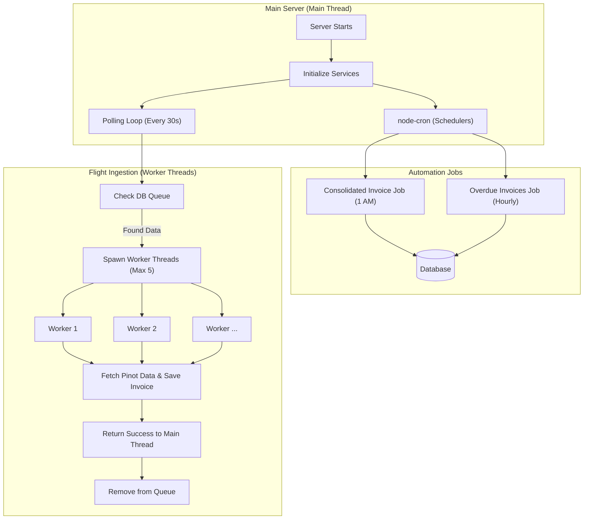

# Background Processing & Automation Guide

This document explains how the system handles tasks that run "in the background" (outside of normal user requests) like generating invoices every day or processing flight data.

## 1. Overview of Automated Tasks

The system uses three main ways to handle work that doesn't happen instantly:

1.  **Cron Jobs (Schedulers)**: Tasks that run at a specific time (like an alarm clock).
2.  **Background Workers (Threads)**: Heavy work that runs in parallel so the website stays fast.
3.  **Polling Loops**: Tasks that keep checking for new work every few seconds.

---

## 2. Cron Jobs (The "Schedulers")

We use a library called `node-cron`. It's like a calendar for the server.

### Consolidated Invoice Scheduler
- **What it does**: Checks which customers need a weekly or monthly invoice.
- **When it runs**: Every day at **1:00 AM**.
- **How it handles Frequency**: 
    - Even though the script runs **every day**, it only creates an invoice when a customer's period actually ends.
    - **Weekly**: If a customer's week ends on Monday, the script will skip them from Tuesday to Sunday, and only generate the invoice on Monday.
    - **Monthly**: The script will skip the customer every day until it detects it is the **last day of the month**.
- **Special Feature**: It uses a "Lock". If you have two servers running, only one will perform the job so you don't send the same invoice twice.

### Invoice Overdue Scheduler
- **What it does**: Looks for invoices that haven't been paid and are past their due date.
- **When it runs**: Once every **hour**.
- **Action**: Changes the status from `PENDING` to `OVERDUE`.

---

## 3. Worker Threads (The "Heavy Lifters")

When processing thousands of flights, the server could "freeze" if it does everything at once. We use **Worker Threads** to prevent this.

### Flight Data Ingestion
The system checks the `FlightProcessingQueue` every 30 seconds. Instead of the main server doing the work, it "spawns" (creates) separate workers.

**How it works:**
1.  **Main Thread**: Sees 10 flights in the queue.
2.  **Spawning**: It creates 5 "Worker Threads".
3.  **Parallel Work**: Each worker handles one flight at a time.
4.  **Completion**: When a worker finishes, the main thread deletes the flight from the queue.

---

## 4. Work Flow Diagram (DFD)

This diagram shows how data flows through the background services:

---

## 5. Simple Dictionary

- **Cron**: A tool that triggers code based on time/date.
- **Thread**: A single "path" of execution. **Worker Threads** allow multiple paths to run at once.
- **Polling**: Continuously asking "Is there any new work?" at fixed intervals.
- **Distributed Lock**: A "Stop Sign" shared between servers. It ensures only one server performs a specific task at a time.
- **Ingestion**: The process of bringing data from one place (like a queue or external database) into our system.

---

## 6. How to Monitor
- **Logs**: Check the logs for prefixes like `[INGESTION]`, `[SCHEDULED]`, or `[DATABASE]`.
- **Benchmark Files**: Background workers save their performance stats in `benchmarks/results.json`.
