# Daily Flight Processing Report

<div align="center">

## Davinci Aviation Invoice System

</div>

---

## Executive Summary

| Metric | Value | Status |
|--------|-------|--------|
| **Total Flights Processed** | 140 | ✅ |
| **Invoices Generated** | 0 | ⚪ |
| **Non-Billable Flights** | 131 | ✅ |
| **Error Invoices** | 9 | ⚠️ |
| **System Failures** | 0 | ✅ |

---

## Error Root Cause Analysis

### Why 8 Flights Failed to Generate Invoices

```mermaid
flowchart TD
    A[🛫 Flight Crosses<br/>Billable FIR] --> B[📋 Extract Aircraft<br/>Registration Number]
    B --> C[🔍 Lookup Aircraft<br/>in External Databases]
    
    C --> D[Query IBA API]
    C --> E[Query JetNet API]
    
    D --> F{IBA Found<br/>Operator?}
    E --> G{JetNet Found<br/>Operator?}
    
    F -->|❌ No| H[IBA ID: none]
    G -->|❌ No| I[JetNet ID: none]
    F -->|✅ Yes| J[Use IBA Operator Data]
    G -->|✅ Yes| K[Use JetNet Operator Data]
    
    H --> L{Any Operator<br/>Identified?}
    I --> L
    J --> M[✅ Create Invoice Successfully]
    K --> M
    
    L -->|❌ Neither API<br/>returned data| N[⚠️ OPERATOR_ID_NOT_FOUND]
    L -->|✅ At least one| M
    
    N --> O[📝 Error Invoice Created]
    O --> P[Flight logged to<br/>error-invoices.json]
    
    M --> Q[💰 Invoice Saved<br/>to Database]
    
    style A fill:#2196F3,color:white
    style N fill:#f44336,color:white
    style O fill:#f44336,color:white
    style P fill:#f44336,color:white
    style M fill:#4CAF50,color:white
    style Q fill:#4CAF50,color:white
    style H fill:#FF9800,color:white
    style I fill:#FF9800,color:white
```



### Root Cause Summary

| Issue | Description |
|-------|-------------|
| **Error Type** | OPERATOR_ID_NOT_FOUND |
| **Affected Flights** | 8 unique flights |
| **Root Cause** | Aircraft registration not found in IBA or JetNet databases |
| **Impact** | Billable flights could not be invoiced |

### Common Reasons for Missing Operator Data

1. **Newly Registered Aircraft** - Not yet indexed in databases
2. **Private/Experimental Aircraft** - Not tracked in commercial databases
3. **Foreign Registrations** - Some countries not covered by IBA/JetNet
4. **Data Sync Delay** - Recent registration changes not yet updated

---

## Processing Statistics

### Overall Summary

```
┌─────────────────────────────────────────────────────────────┐
│                  FLIGHT PROCESSING SUMMARY                   │
├─────────────────────────────────────────────────────────────┤
│  Total Flights Analyzed         │         140               │
│  ──────────────────────────────────────────────────────────│
│  ✅ Successfully Invoiced        │           0  (0.0%)       │
│  ⚪ Non-Billable (No FIR Cross)  │         131  (93.6%)      │
│  ⚠️ Error Invoices               │           9  (6.4%)       │
│  ❌ Failed Processing            │           0  (0.0%)       │
└─────────────────────────────────────────────────────────────┘
```

### Processing Timeline

| Batch | Time (UTC) | Flights | Cumulative | Status |
|-------|------------|---------|------------|--------|
| 1 | 07:22:44 | 10 | 10 | ✅ |
| 2 | 07:25:50 | 10 | 20 | ✅ |
| 3 | 07:26:52 | 10 | 30 | ✅ |
| 4 | 07:27:53 | 10 | 40 | ✅ |
| 5 | 07:30:19 | 10 | 50 | ✅ |
| 6 | 07:32:00 | 10 | 60 | ✅ |
| 7 | 07:32:57 | 10 | 70 | ✅ |
| 8 | 07:34:41 | 10 | 80 | ✅ |
| 9 | 07:35:41 | 10 | 90 | ✅ |
| 10 | 07:38:58 | 10 | 100 | ✅ |
| 11 | 07:39:57 | 10 | 110 | ✅ |
| 12 | 07:43:01 | 10 | 120 | ✅ |
| 13 | 07:43:54 | 10 | 130 | ✅ |
| 14 | 07:44:49 | 10 | 140 | ✅ |

---

## Non-Billable Flights Analysis

### Classification Breakdown

| Classification | Count | Percentage |
|----------------|-------|------------|
| No FIR Crossing Detected | 131 | 100% |

### Monitored Flight Information Regions (FIRs)

The system monitors 16 specific FIRs for billing purposes:
- Syria, Bahrain, Libya, DRC (Democratic Republic of Congo)
- Malawi, Uganda, Guinea region, and other designated territories

**Flights marked as NON_BILLABLE** did not traverse any of these monitored airspaces.

---

## Error Invoice Analysis

### Summary

| Error Type | Unique Flights | Total Occurrences |
|------------|----------------|-------------------|
| OPERATOR_ID_NOT_FOUND | 8 | 19 |

### Error Flow Diagram


### Affected Flights

| # | Flight ID | Error Type | IBA ID | JetNet ID |
|---|-----------|------------|--------|-----------|
| 1 | 2733174769 | OPERATOR_ID_NOT_FOUND | none | none |
| 2 | 2733185729 | OPERATOR_ID_NOT_FOUND | none | none |
| 3 | 2733111857 | OPERATOR_ID_NOT_FOUND | none | none |
| 4 | 2733095838 | OPERATOR_ID_NOT_FOUND | none | none |
| 5 | 2733035234 | OPERATOR_ID_NOT_FOUND | none | none |
| 6 | 2733178464 | OPERATOR_ID_NOT_FOUND | none | none |
| 7 | 2733171783 | OPERATOR_ID_NOT_FOUND | none | none |
| 8 | 2733110894 | OPERATOR_ID_NOT_FOUND | none | none |

---

## System Components

### Component Architecture


### System Health

| Component | Status | Notes |
|-----------|--------|-------|
| Pinot Data Source | ✅ Operational | 140 flights fetched |
| Python Pipeline | ✅ Operational | FIR detection working |
| IBA API | ⚠️ Partial | 8 lookups failed |
| JetNet API | ⚠️ Partial | 8 lookups failed |
| Database | ✅ Operational | PostgreSQL connected |
| Daily Logging | ✅ Operational | All files written |

---

## Output Files Generated

| File | Size | Records | Path |
|------|------|---------|------|
| processed-flights-summary.json | 14.7 KB | 140 | processed-results/29-january-2026/ |
| non-billable-flights.json | 9.6 KB | 131 | processed-results/29-january-2026/ |
| error-invoices.json | 3.8 KB | 19 | processed-results/29-january-2026/ |

---

## Status Distribution

```
Total Processed: 140 Flights

├── ⚪ Non-Billable ████████████████████████████████████████ 131 (93.6%)
├── ⚠️ Error        ███░░░░░░░░░░░░░░░░░░░░░░░░░░░░░░░░░░░░░   9 (6.4%)
├── ✅ Invoiced     ░░░░░░░░░░░░░░░░░░░░░░░░░░░░░░░░░░░░░░░░   0 (0.0%)
└── ❌ Failed       ░░░░░░░░░░░░░░░░░░░░░░░░░░░░░░░░░░░░░░░░   0 (0.0%)
```

---

## Recommendations

### Immediate Actions

1. **Investigate Error Flights**
   - Review 8 flights with OPERATOR_ID_NOT_FOUND errors
   - Manually identify operators for billable flights

2. **Configure AWS Credentials**
   - Add S3 credentials to enable flight map uploads

### Long-Term Improvements

1. **Operator Lookup Fallback**
   - Implement manual intervention queue
   - Create local cache of operator mappings

2. **Enhanced Error Reporting**
   - Add aircraft registration to error logs
   - Implement automatic reprocessing queue

---

<div align="center">

**End of Report**

*Generated by Davinci Flight Processing System*  
*January 29, 2026 - 13:00 PKT*

</div>
